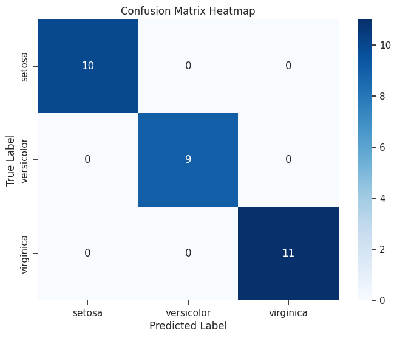
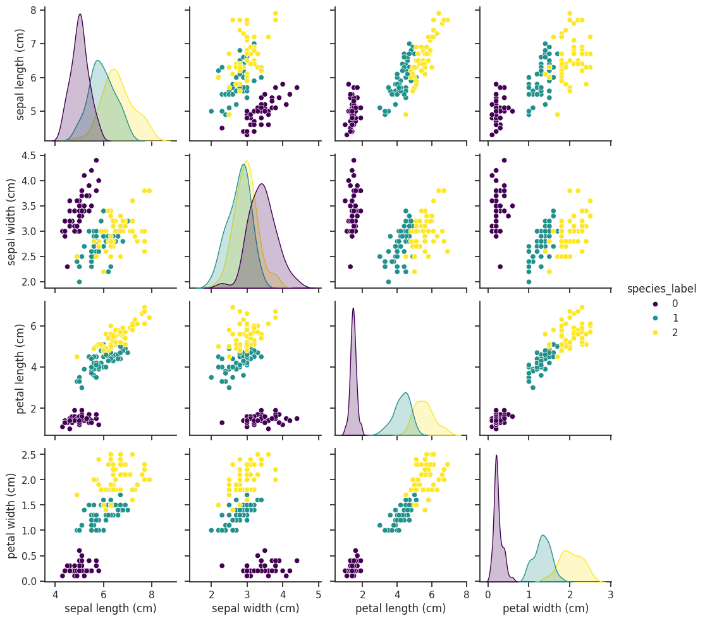

# Iris Flower Species Classification using Machine Learning

[](https://colab.research.google.com/github/TWO-ONE-21/iris-classification-project/blob/main/notebooks/iris.ipynb)


## 📋 Project Description

This project aims to build a machine learning model capable of classifying three species of Iris flowers (Iris setosa, Iris versicolor, and Iris virginica) based on four features: sepal length, sepal width, petal length, and petal width. The project implements a complete end-to-end machine learning workflow, from data loading and analysis to model evaluation.

## 🗂️ Dataset

The project utilizes the classic 'Iris dataset' available in the Scikit-learn library. This dataset consists of 150 samples, with 50 samples for each of the three species. It contains no missing values and is well-suited for classification tasks.

## 🗺️ Project Workflow

The project workflow includes the following key stages:

 **Environment Setup**: Importing all necessary Python libraries for the entire workflow, including Pandas, NumPy, Matplotlib, Seaborn, and Scikit-learn.

 **Data Loading and Inspection**: Loading the dataset and converting it into a Pandas DataFrame for easier manipulation and analysis. Initial inspection was done using `.head()`, `.info()`, and `.describe()` to understand the data structure.

 **Exploratory Data Analysis (EDA)**: Visualizing the data to identify patterns, relationships between features, and the most discriminating features among the classes.

 **Data Preprocessing**: Separating the features (X) from the target variable (y) and splitting the dataset into a training set (80%) and a testing set (20%).

 **Model Building and Training**: Implementing the K-Nearest Neighbors (KNN) classification algorithm, initialized with K=3. The model was then trained using the training data.

 **Model Evaluation**: Measuring the performance of the trained model on the unseen test data.

## 🏆 Results and Performance

The trained K-Nearest Neighbors (KNN) model successfully achieved **100% accuracy** on the test data.

This perfect performance was further confirmed by the **Classification Report** and **Confusion Matrix**, where all metrics (precision, recall, f1-score) showed a score of 1.0 for every class. The confusion matrix indicated zero misclassifications.

|                 | precision | recall | f1-score | support |
|:---------------|----------:|-------:|---------:|--------:|
| **setosa** |      1.00 |   1.00 |     1.00 |      10 |
| **versicolor** |      1.00 |   1.00 |     1.00 |       9 |
| **virginica** |      1.00 |   1.00 |     1.00 |      11 |
|                 |           |        |          |         |
| **accuracy** |           |        |     1.00 |      30 |
| **macro avg** |      1.00 |   1.00 |     1.00 |      30 |
| **weighted avg**|      1.00 |   1.00 |     1.00 |      30 |



## 🔎 Insights from Data Analysis

- Through a pairplot visualization, it was clearly observed that the `petal length (cm)` and `petal width (cm)` features are the most powerful discriminators for separating the species.
- The Iris setosa species is linearly separable from the other two species.
- A correlation heatmap confirmed that `petal_length` and `petal_width` have the strongest positive correlation with the target species label (0.95 and 0.96, respectively).



## 🛠️ Technology Stack

* **Python**
* **Pandas**
* **NumPy**
* **Matplotlib & Seaborn**
* **Scikit-learn**
* **Environment**: Google Colaboratory

## 🚀 How to Run

There are two primary ways to run this project: through Google Colaboratory or by setting it up on your local machine.

### Option 1: Running in Google Colaboratory (Recommended)

This is the easiest way to run the project as it requires no local installation of Python or its libraries.

* Open [Google Colaboratory](https://colab.research.google.com/).
* Click on `File` > `Open notebook`.
* In the pop-up window, select the **`GitHub`** tab.
* Paste the repository URL in the search bar: `https://github.com/TWO-ONE-21/iris-classification-project`
* Press Enter, and select the notebook file `notebooks/iris.ipynb` from the list.
* Once the notebook is open, run the cells sequentially from top to bottom by pressing `Shift + Enter`.

### Option 2: Running on a Local Machine

If you prefer to run the project locally, you need to have Python and Jupyter Notebook installed.

* **Clone the repository:**
    ```bash
    git clone https://github.com/TWO-ONE-21/iris-classification-project.git
    ```
* **Navigate to the project directory:**
    ```bash
    cd iris-classification-project
    ```
* **Install the required libraries:**
    ```bash
    pip install pandas numpy scikit-learn matplotlib seaborn jupyter
    ```
* **Start Jupyter Notebook**
    ```bash
    jupyter notebook
    ```
* In the Jupyter interface that opens in your browser, navigate to the `notebooks` folder and open the notebook file `iris.ipynb`.

---
